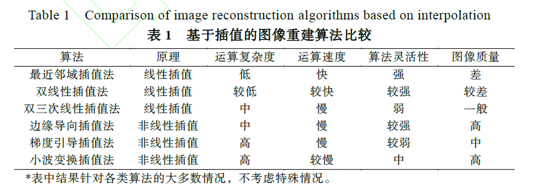
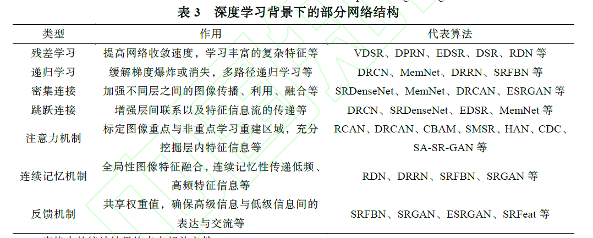

# 钟梦圆，姜麟．超分辨率图像重建算法综述

超分辨率图像重建利用已知的图像信息建立LR 图像与HR 图像之间的特征序列关系，其数学模型为：利用“系统成像模型”自身的一些
变化手段对退化后的图像实现重建。

# 苏衡, 周杰, 张志浩. 超分辨率图像重建方法综述

# 郑璐, 王保云.基于深度学习的超分辨率图像重建研究综述

卷积神经网络、残差网络、递归神经网络、密集卷积网络、生成对抗网络五种不同的深度网络模型概述。SRDenseNet性能好。

 

# 李佳星, 等.基于深度学习的单幅图像超分辨率重建算法综述

## 基于卷积神经网络的超分辨率重建

**有监督学习**

1. SRCNN 首个深度学习SR
2. FSRCNN（Fast super-resolution convolutional neural network）反卷积上采样，快
3. VDSR（Very deep convolutional network for super-resolution） 极深，感受野大
4. ESPCN 亚像素卷积上采样，更快
5. RED-Net（Very deep residual encoder-decoder networks） 提取特征并去噪
6. MemNet 长期记忆模型，+若干记忆模块
7. SRDenseNet 密集连接、图像信息不易丢失
8. RDN 残差密集模块，改进SRDenseNet
9. EDSR  跳跃连接、去BN
10. WDSR 去冗余卷积，改进残差块，改进EDSR
11. NatSR +自然流形鉴别器，视觉效果好
12. DRCN 递归层
13. DRRN 间隔层权重共享，改进DRCN
14. LapSRN 比同期DRRN好
15. DSRN 双循环网络
16. SRGAN 感官质量好
17. ESRGAN 去BN，加残差密集模块
18. SFTGAN 空间特征转换层
19. DBPN 结合迭代反投影方法，上下采样交替进行，提供反馈机制
20. SRFBN 递归结构反馈流，基于课程训练策略，学习复杂退化
21. RCAN 通道注意力机制+残差块
22. SAN 二阶注意力网络
23. Meta-SR 单模型任意缩放因子(包含非整数) 的超分

损失函数：像素损失、内容损失、对抗损失、纹理损失、总变差损失以及上下文损失等。

**弱监督学习**

1. CycleGANSR 用不成对的LR-HR图像训练得到退化模型
2. CinCGAN  先学去噪再学超分

**无监督学习**

1. ZSSR 不需预训练，简单，适用任意尺度超分，每张测试图像都要单独训练一个网络
2. 深度神经网络本身就有先验知识（Lempitsky）

**盲超分辨率**

blind和non-blind的区别用一句话来概括就是：是否假设退化核已知并将其作用于图像来做网络训练。

1. SRMD 考虑噪声和模糊两种退化核
2. SFTMD 逐步校正模糊核
3. DPSR 引入能量函数优化退化模型, 采用变量分割的方法实现即插即用