# Learning a Deep Convolutional Network for Image Super-Resolution

提出SRCNN

传统的稀疏编码可以看做是深度卷积网络的一个特例

SRCNN的优点：设计简单，质量高；计算速度快，因为全是前向传播过程，不同于传统算法需要解最优化问题；可以使用更丰富的数据，更复杂的网络结构来达到更高的质量，而传统方法做不到这一点。

主要分为三个部分，特征提取和表征，非线性映射，重构。

只要损失函数可导，就可以将其作为损失函数进行训练，优化网络。

训练图像获得：直接以步长14裁剪原图像（更小的步长对训练的提升没有明显效果），再使用高斯核模糊，以某一缩放因子下采样，再使用双三次插值回原尺寸。训练图像只使用了YCrCb颜色空间的的明度通道，其它两个色度通道只用作合成展示。可以使用三通道图像进行训练，但是为了与传统方法进行对比（传统方法通常只能使用明度通道进行训练/还原），只使用了明度通道进行训练。

较小的学习速度更有利于训练。

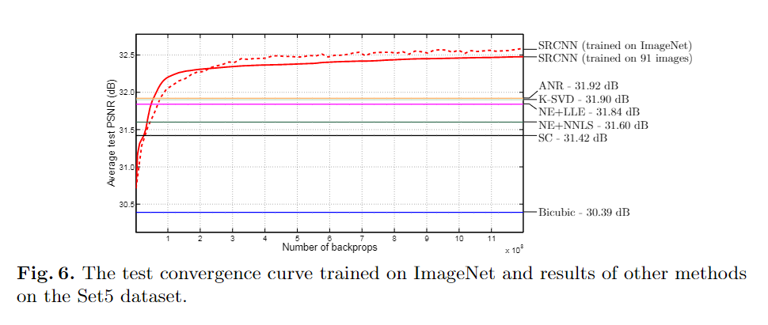

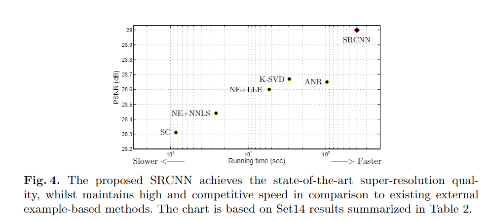

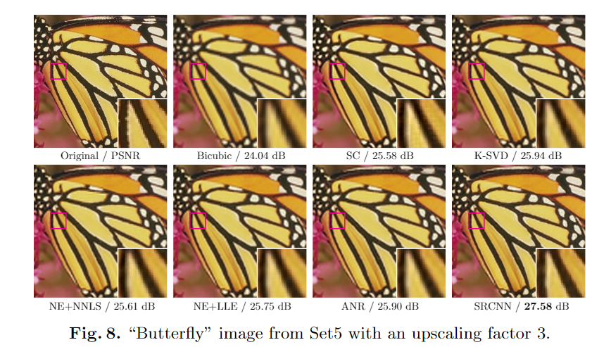

***

# Deep Learning for Image Super-resolution: A Survey

## 引言

超分辨率是一个病态问题，因为一个LR图像可能对应多个HR图像

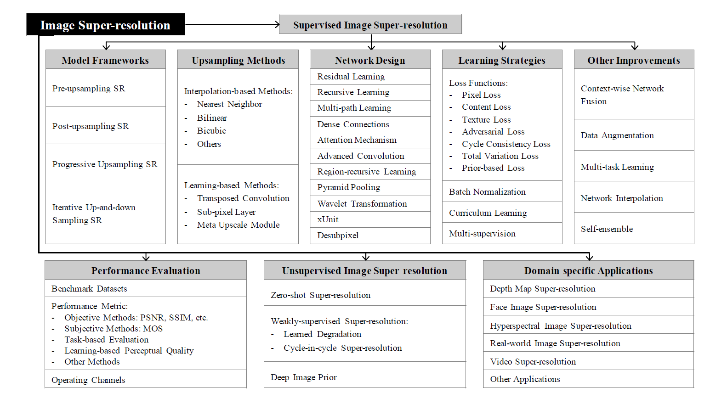

退化模型：直接下采样，模糊核+高斯噪声。后者更接近于实际情况，且更有利于SR。

HR无配对图像时，通常使用MATLAB的imresize函数生成LR图像。

## 图像质量评估

主观评估是我们真实需要的，但是费时费力。因此客观评估是主流方法。但是这两者的评估结果并不完全一样。

- PSNR 峰值信噪比，难以达到真实需求但还是最常用的方法
- the structural similarity index (SSIM)，评估结构相似性（明度、对比度、结构），视觉评估效果较好
- mean opinion score平均意见分数（MOS） 主观评估
- 基于学习的感知质量
- 基于任务的评估  将SR图像和LR图像用作后续的任务，如物体检测、人脸识别等
- MS-SSIM、FSIM、NIQE。有数学证明，失真(如PSNR, SSIM)和感知质量（如MOS）相互矛盾，随着失真减小，（主观）感知质量必然会变差。

在不同通道（RGB和YCbCr）上的训练和评估，有可能会产生巨大的评估差别

## Supervised SR

### 架构

预上采样SR   经典SRCNN，先双三次插值上采样再学习，减小了学习难度。缺点：噪点放大、模糊，计算时间和空间耗费多。

后上采样SR   主要在低维空间中计算，计算效率高。缺点： 高缩放倍数SR学习困难；每一个缩放倍数下都需要训练一个单独的模型，没办法实现多尺度SR。

渐进上采样SR  将复杂问题分解成简单问题，降低了训练难度，尤其是对于大缩放倍数任务，而且在不使用过多的时间和空间成本的情况下可以实现多尺度SR。  缺点：模型设计复杂，训练不稳定，需要更先进的训练技术和更丰富的经验。

迭代上下采样SR   交替使用下采样和上采样，能更好地捕捉LR-HR之间的相互关系。但是反投影设计标准不明确。

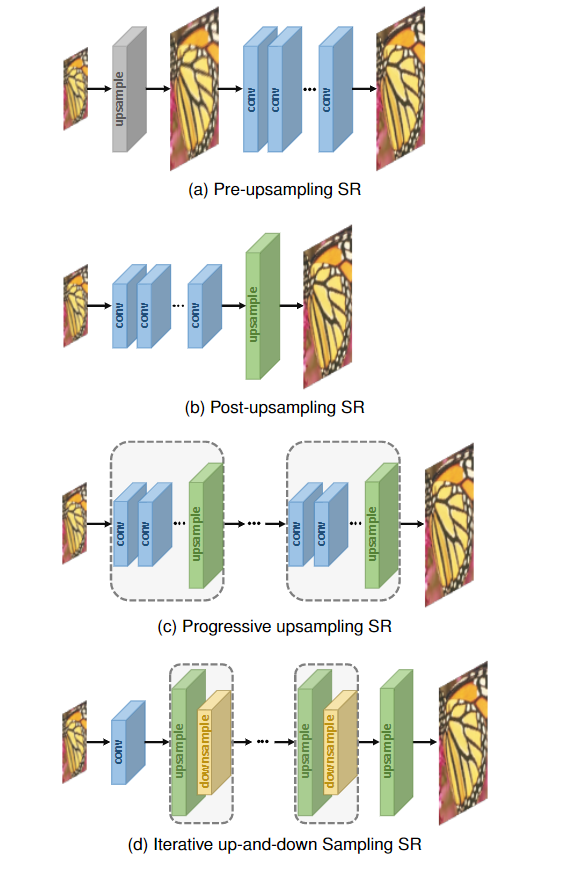

### 上采样方法

**基于插值的上采样**

最邻近内插（Nearest-neighbor Interpolation）快，会出现色块、图像质量低

双线性插值（Bilinear Interpolation）相对快，质量较前者好很多

双三次插值（Bicubic Interpolation）图像更平滑，伪影更少，但是速度很慢

**基于学习的上采样**

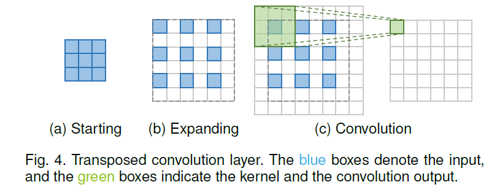

转置卷积层（Transposed Convolution Layer）  反卷积，会保留与普通卷积相兼容的连接模式。但每个轴上都易产生不均匀重叠现象，最后会导致不同量级的棋盘图案，有损SR性能。

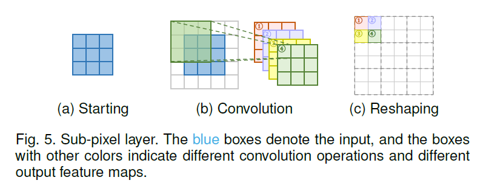

次像素层（sub-pixel layer）  局部感受野更大，但在不同块的边界易产生伪影且会导致输出不光滑。

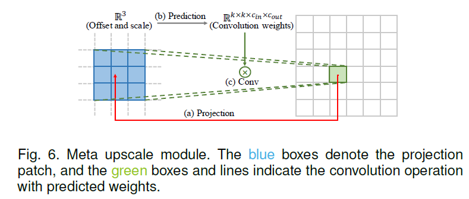

元升尺度模型（Meta Upscale Module）  单一模型可以实现任意倍数的连续缩放，且计算量不会增加很多，但大缩放倍数下不稳定、低效。

### 网络设计

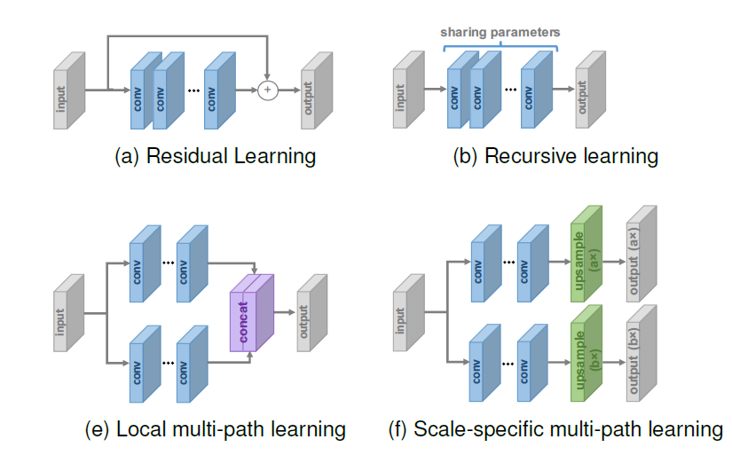

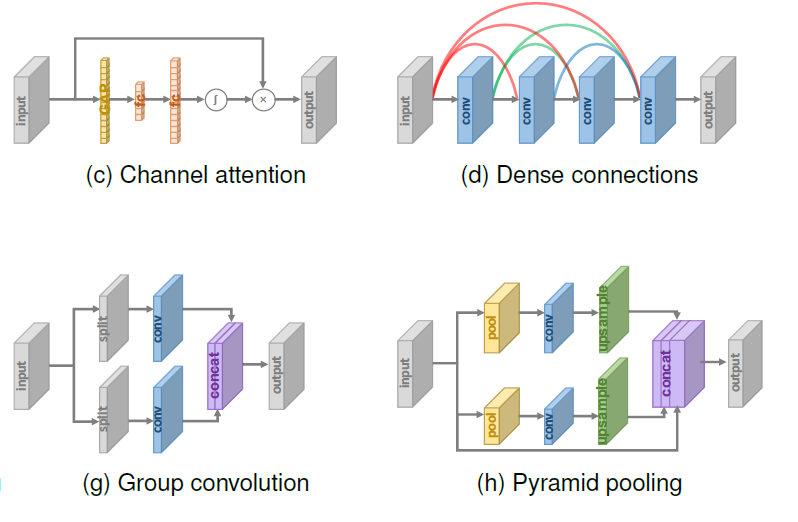

残差学习  -全局/局部残差学习，LRHR图像高度相关，学习残差图来恢复高频信息，提升了训练的稳定性，降低了模型的复杂度和学习难度。

递归学习  -不引入过多参数就能捕捉到更高级的特征，但是仍然无法避免消耗大量的计算资源，天然带有梯度消失或梯度爆炸的特性。

多路径学习  -全局多路径学习、局部多路径学习、特定尺度多路径学习，通过不同的路径学习不同的特征，最后将其融合。

密集连接  -缓解了梯度消失，增强信号传播，特征重利用，且大大减少了模型大小。

注意机制  -通道注意：利用通道间的相互联系和作用，更好地表征了特征，性能更好。

                -非局部注意：捕捉远距离像素的关系。

高级卷积  -扩张卷积，增大感受野。群卷积&深度可分卷积，牺牲小部分精度大大减少参数。

区域递归学习  -逐像素序列生成，在某些方面上性能很好，对SR来说计算成本和训练难度太大。

金字塔池化  -利用全局和局部信息

小波变换  -分别捕捉高频局部纹理和低频全局拓扑，能够有效减少模型大小和计算时间，并能保留比较好的性能。

去次像素  -在智能手机上测试，计算速度快性能好。

xUnit  -结合空间特征处理和非线性激活学习复杂特征，计算消耗大。但同等模型大小下，性能表现更好/同等性能表现下，模型更小。

### 学习策略

**损失函数**

像素损失（L1、L2、Charbonnier Loss ） 

L2通常会使图像过光滑。L1效果更好。像素损失训练PNSR分值高，但是会丢失高频细节，纹理过光滑视觉效果不好。

内容损失（content loss）  视觉感知效果更好。

纹理损失（Texture Loss）  生成更真实的纹理，视觉效果好，但是匹配纹理的块大小还主要由经验决定。

对抗损失（Adversarial Loss）  GAN训练困难且不稳定。

循环一致性损失（Cycle Consistency Loss）  CycleGAN、cycle-in-cycle GAN

总变差损失（Total Variation Loss）  用临近像素的绝对差表示，评估图像中噪点的多少。

基于先验的损失（Prior-Based Loss）  内容损失和纹理损失本质上都提供了分级的图像特征的先验知识。引入越多的先验知识，SR效果越好。

可以使用多种损失加权，平衡失真和视觉效果。

**Batch Normalization**

加速稳定训练，但丢失了图像的尺度信息，消除了网络的范围灵活性，降低性能，占内存。

**Curriculum Learning 渐进式学习**

难度由低到高，小缩放倍数到大缩放倍数。降低了训练难度，缩短了总训练时间。将大放大倍数问题分解为多个小放大倍数问题。

**Multi-supervision多重监督**

将每个残差单元的输出都重构为HR图像，最后将各个图像一起重构。

### 其它策略

模型输出融合（Context-wise network fusion）

数据增强（Data augmentation）  随机打乱RGB通道，增强数据还能缓解数据的色彩失衡。

多任务学习（multi-task learning）  不同的任务关注不同的数据特征，将相关的任务组合能够提供额外的信息，SR模型性能更好

网络插值（Network Interpolation）  训练基于PNSR的模型和基于视觉感知的模型，生成中间模型，最后微调中间模型的插值权重

自组（Self-ensemble）  将原图像变换（旋转，翻转）输入SR，最后结果取均值或中位数

### 高性能模型

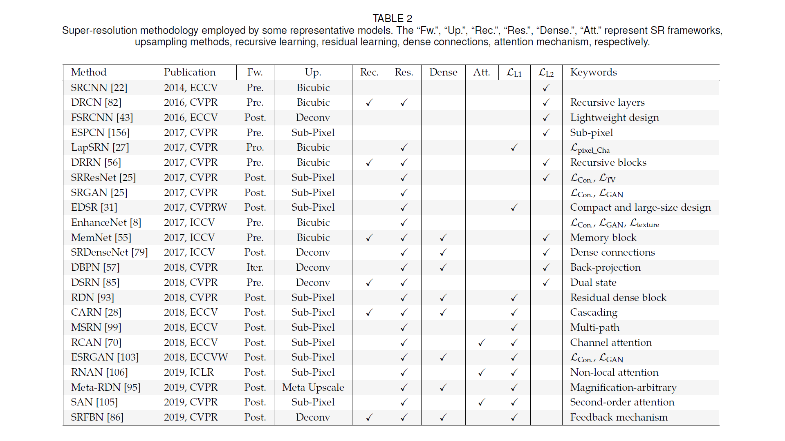

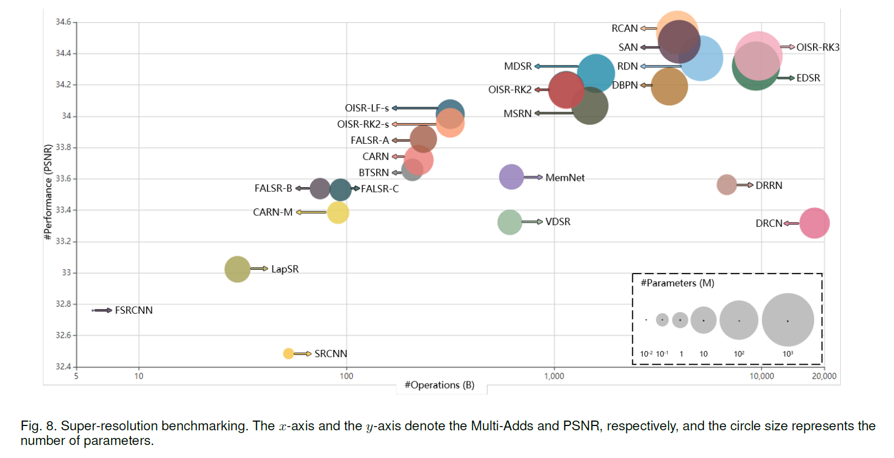

## Unsupervised SR

实际生活中很难获取配对的LR-HR图像，训练中LR图像通常由预设的退化算法获得，因此学到的是退化算法的逆过程。

### Zero-shot Super-resolution（零次学习超分辨率）/ZSSR

针对特定的图像进行训练，而不是利用多种数据生成通用模型。能够利用图像内部的跨尺度信息。

缺点：针对不同的图像需要训练不同的模型，推断时间远远长于其他方法

### Weakly-supervised SR

**Learned Degradation（习得性退化）**

利用非配对的LR、HR图像训练HR-to-LR GAN学习退化关系，输入HR用其生成匹配的LR图像。再用配对的LR、HR图像训练LR-to-HR GAN。
训练过程中，不仅要使图像结果匹配，还要使结果的分布与真实图像分布匹配。

真实图像SR效果明显好于监督SR

**Cycle-in-cycle SR**

cycle-in-cycle SR network (CinCGAN)

能够匹配目标域分布，并通过往返映射使图像可恢复（例如，使用noisy LR生成clean LR， 再使用clean LR生成原noisy LR）。

即使在很恶劣的条件下也能适用各种任务，但是训练复杂且不稳定。

### Deep Image Prior（深度图像先验）

证实了CNN结构的合理性

## 特定领域的应用

**深度图SR**  通常用于姿势估计、语义分割

**人脸SR**   特殊应用，通常利用面部信息先验知识辅助训练

**超光谱图SR（Hyperspectral Image Super-resolution）**  能提供丰富的光谱特征

**真实图像SR**  相机拍到的照片会经过ISP一系列处理（如去马赛克、去噪、压缩等）生成8-bitRGB图片，过程中会丢失很多原始信号最后会导致与真实照片有很大差距。

**视频SR**  存在帧内的空间依赖关系和帧间的时间依赖关系（时空依赖性）。

**其它应用**  局部、特征超清，利用立体图（透视图）中的视差先验超分，利用三维几何信息超请解析纹理，SR光场图像

## 结论

### 网络设计

结合局部和全局信息，提供不同尺度的上下文信息。

结合高阶（目标特征）低阶（颜色、边缘）信息

特定环境注意力机制（Context-specific Attention）  针对特定的对象使用注意力机制关注重要特征，生成真实细节

更高效的结构  现有模型追求极致性能而忽略了计算效率

上采样方法  插值法计算慢且不能直接嵌入端对端（end-to-end）学习；转置卷积（transposed convolution）会产生棋盘伪影；次像素层（sub-pixel layer）会带来感受野的不均匀分布；元放大模型（meta upscale module）不稳定且低效有很大提升空间。

### 学习策略

更合适的损失函数  能够更好地描述LR、HR、SR图像之间的关系

标准化  batch normalization已被证明对训练不利，其他的标准化方法作用有待研究

### 精度更好的评估准则

### 无监督学习更适合学习真实图像超分规律

### 面向真实场景

真实图像可能存在各种退化

***

# Real-World Single Image Super-Resolution:A Brief Review

## 引言

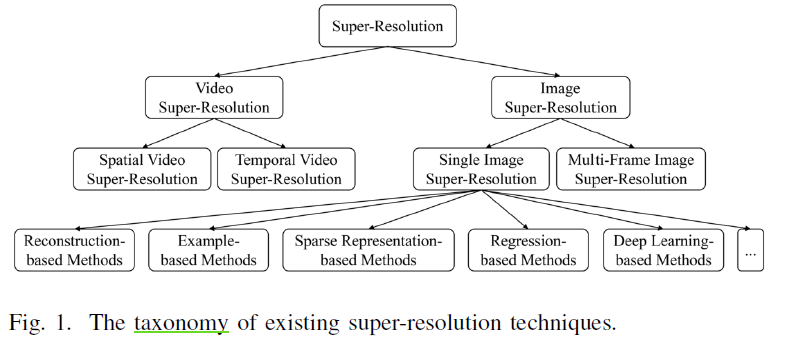

multi-frame image super-resolution (MISR) （多帧合成一张图片）、 single image super-resolution(SISR)（单张LR生成单张HR）

真实图像的退化过程更复杂多样，合成的LR图像和真实观测的LR图像之间存在域间隙（domain gap）

## 数据集和评估标准

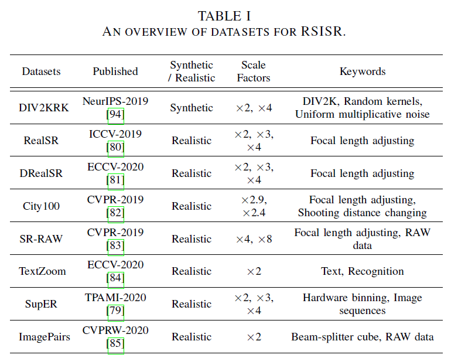

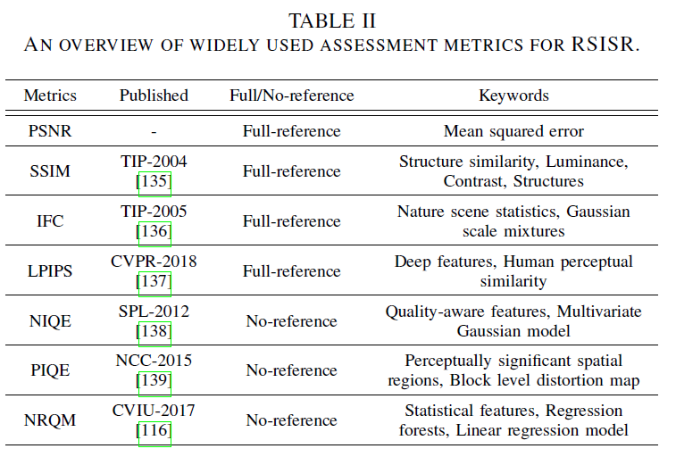

**信息保真度标准 (information fidelity criterion/IFC) **  

利用自然场景和畸变模型量化测试图像和参考图像之间的交互信息

**学习感知图像块相似性（learned perceptual image patch similarity/LPIPS）**

计算深度特征空间中参考和测试图像间的l2距离

**自然图像质量评估器（natural image quality evaluator/NIQE）**

 “盲测，不引入先验知识”，使用多元高斯模型（广义高斯模型、非对称广义高斯模型）拟合自然和测试图像，计算两模型的距离

**基于感知的质量评估器（perception-based quality evaluator/PIQE）**

测试图像划分为非重叠块，进行块级分析，以识别失真和等级质量

**学习无参考质量指标（learned no-reference quality metric/NRQM）**

提取图像的局部频率特征、全局频率特征、空间特征，使用回归森林拟合三个特征的联系，最后将结果线性组合。和主观评估的一致性好。

## 技术和方法

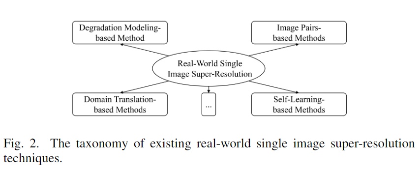

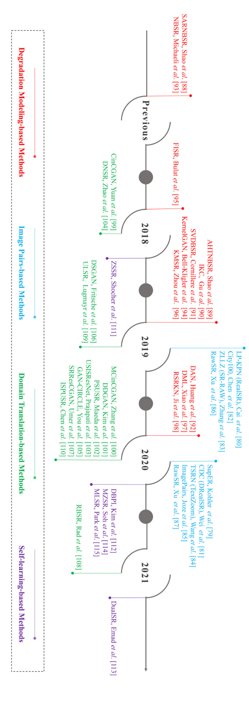

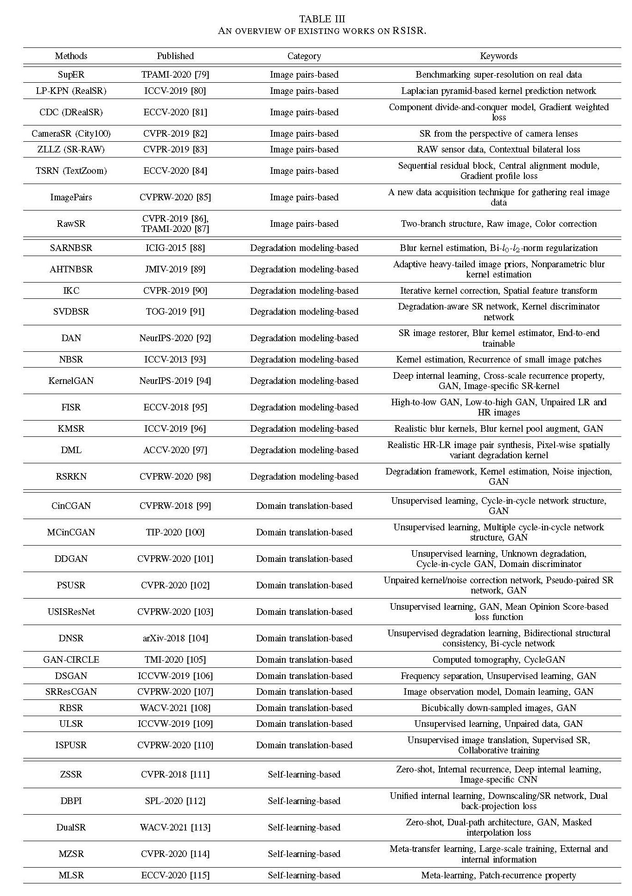

### 基于退化建模的方法

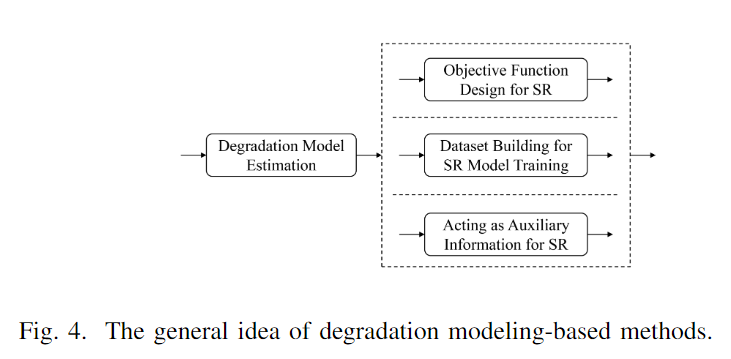

利用退化算法生成LR图像，再用来训练。

对于SR，精准的模糊模型（退化算法）比精密的图像先验更重要。

能量最小化方法，迭代优化参数来获取模糊核的参数；嵌入神经网络，利用SR结果作为指导优化模糊核。

最大化整个LR输入尺度上的重复图像块相似性学习退化过程；利用GAN学习退化过程，生成配对的图像来训练SR。

### 基于图像对的方法

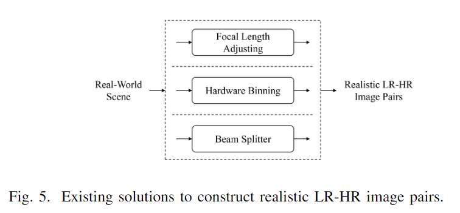

利用预制好的LR、HR成对图像训练。

真实场景中，模糊核通常不均匀会随深度变化；错位问题，使用逐像素loss训练时可能会将模糊伪影引入。

语境双边损失CoBi综合像素级信息和空间像素坐标来衡量图像相似性，另外考虑了RGB像素块和预训练感知特征，具有轻微错位的图像具有很好的鲁棒性。

CDC组分分解处理SR模型，平面、边缘和角落分别识别处理最后综合生成HR图像。

一张raw图像可能对应多张RGB图像，因为无法提供ISP处理信息。可以使用两束CNN，分别用于SR（恢复细小结构）和颜色恢复（根据LR RGB图像）。

对于特定领域，遥感、医疗、文字识别等等可设计特殊的结构。

利用文字信息的强有序性特征TSRN引入双向LSTM机制，同时为了增强形状边缘特征结合了梯度先验损失和L2损失来训练。

### 基于领域转换的方法（Domain Translation-based Methods）

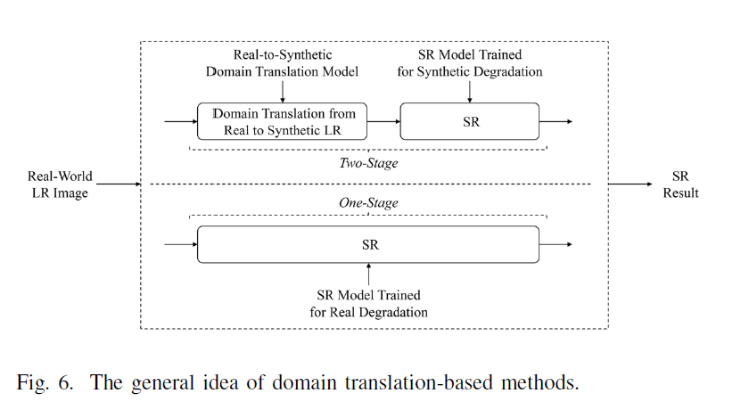

无监督学习，缺少成对图像作为训练。

**二阶法 **

减小合成LR图像域（SLRD）和真实LR图像域（RLRD）的域间隙

分为真实图像到合成图像域转换和SR两步，CinCGAN、MCinCGAN、DDGAN、UISRPS。

 

**一阶法**

直接由真实LR输入生成SR图像。

USISRNet，逐像素内容损失使SR能够保留LR的主要内容；总变差损失用来抑制噪点和伪影；学习平均主观得分作为质量评估损失保证结果有好的感知视觉效果。

借鉴CycleGAN，使用循环一致性约束GAN直接学习PLRD到HRD的映射。

 

**其他方法**

半监督学习，无监督学习生成伪真实LR图片，监督学习成对的伪真实LR图片和HR图片。
使用基于频率分割的损失函数：颜色、纹理、感知损失作为低频组分，整张图片作为高频组分。

### 基于自学习的方法（Self-Learning-based Methods）

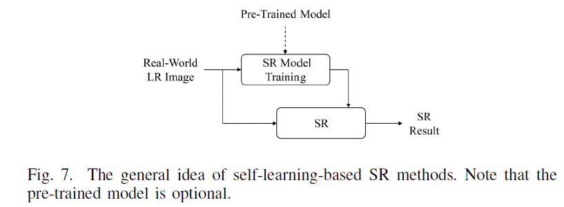

为减轻训练集和测试集的差异性的影响，利用LR输入中的内部信息学习一个特定图像的SR模型。

Zero-Shot SR (ZSSR)     只有一个数据集（直接利用测试集训练，无label），利用信息跨尺度的重现性训练。使用测试集（也是训练集）LR的图像及其退化图像作为样本对学习LR-HR的关系。

自监督学习缺点：只利用了LR输入中的内部信息，一大笔外部信息被忽略了；在测试时计算慢。

为了克服以上缺点，元学习被引入自监督学习。

## 高性能模型的比较

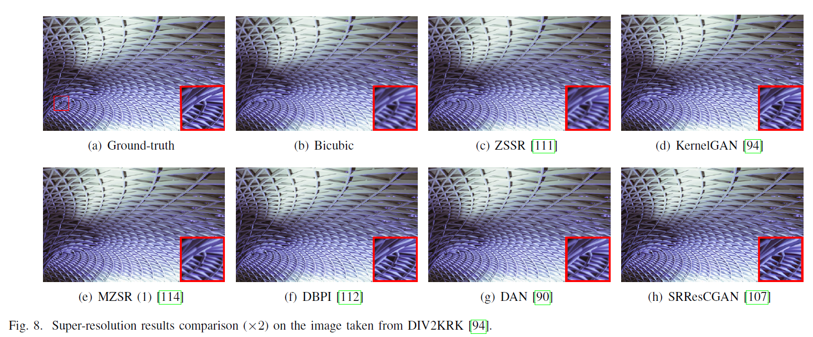

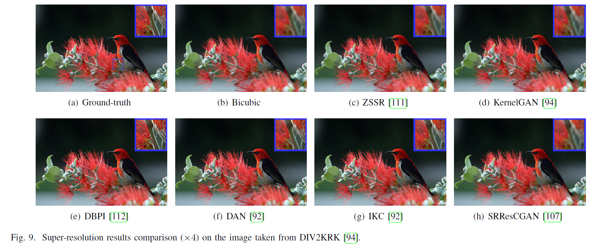

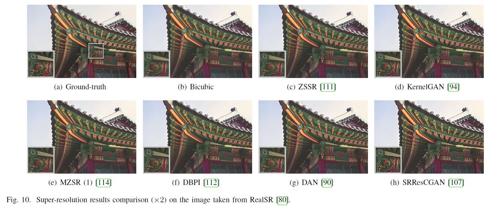

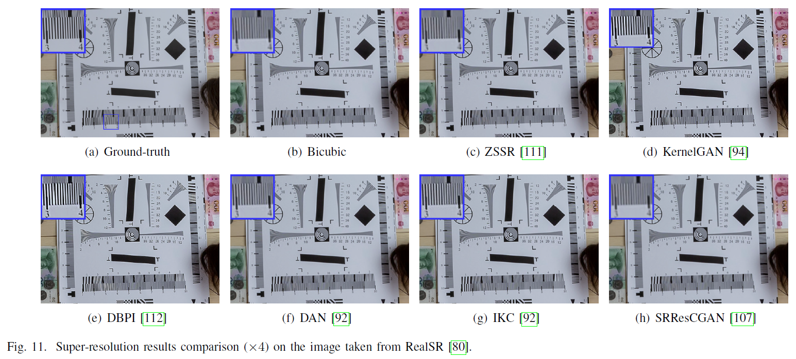

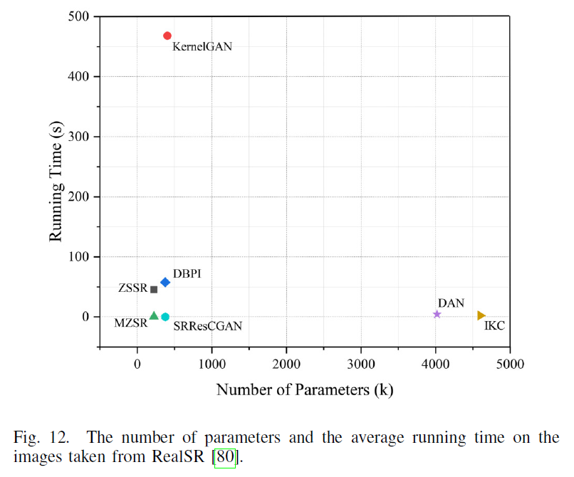

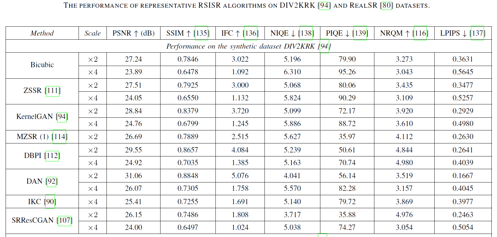

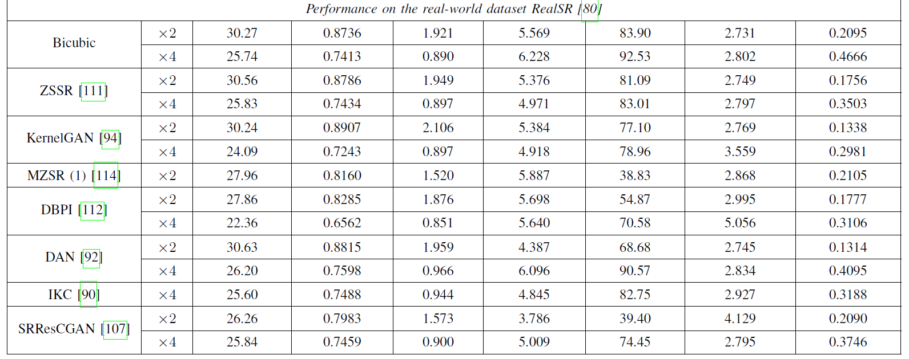

比起传统的双三次插值SR算法效果更好；SR图像和真实图像之间还是有很大差距，尤其是在纹理和边缘区域（过锐化、过光滑现象）；主观客观的评价结果存在分歧；自监督学习的参数比大尺度数据集训练出来的模型的参数少但是测试时好费时间更久。

## 存在的挑战和未来方向

**数据集**

缺少真实图片数据集，数据量少；需要更精确的对齐方式。

**SR算法**

真实图像存在各种不同的退化；现有算法计算时间长、内存占用多、计算量大；现实中很难去获得成对的图像，需要发展能够用不成对训练数据甚至只用LR图像进行训练的模型；个性化多功能需求（针对某种风格实现任意倍数的超清）。

**评估标准**

针对特定任务的评估标准；更精准更方便地评估感知质量的自动化评估标准；有时无参考HR图像，需要无参考质量评估标准。