# SRCNN

##  Porous Structure Reconstruction Using Convolutional Neural Networks-2017

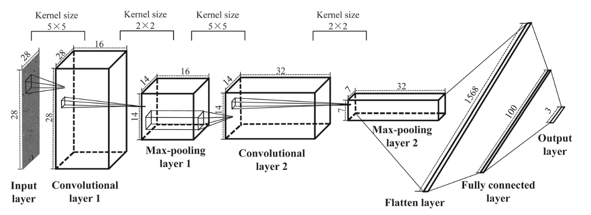

将μ-CT扫描未分割低分辨率图像三次样条插值后做input，SEM分割后高分辨率图像做label（中间像素点相态），直接训练出可自动分割的SR算法，但不能直接处理三维图像

定量评估（Hamming distance，相似度）

形态学评估（更具实际意义）

- 局部孔隙度理论：局部孔隙度分布、局部渗流概率
- 明可夫斯基方程：0，1，2，3阶

CNN处理的图像过于光滑，需要在不增加噪点的情况下减小光滑度

三次样条插值的平滑性避免了CNN处理后出现非连续性现象

## Super Resolution Convolutional Neural Network Models for Enhancing Resolution of Rock Micro-CT Images

Single Image Super Resolution (SISR) 单图超分

CT具有非侵入性和非破坏性。高分辨率CT成像视野小，图像不具代表性。

稀疏编码技术SR效果好，但灵活性差耗时久。

使用DRSRD1_ 2D dataset训练，其中一个数据集（default）使用“双三次”下采样方法，其余“未知”数据集（unknown）应用随机使用box, triangle, cubic, lanczos2, and lanczos3采样方法

使用Bentheimer, Berea, and Leopard Sandstones, and Savonnieres carbonate验证

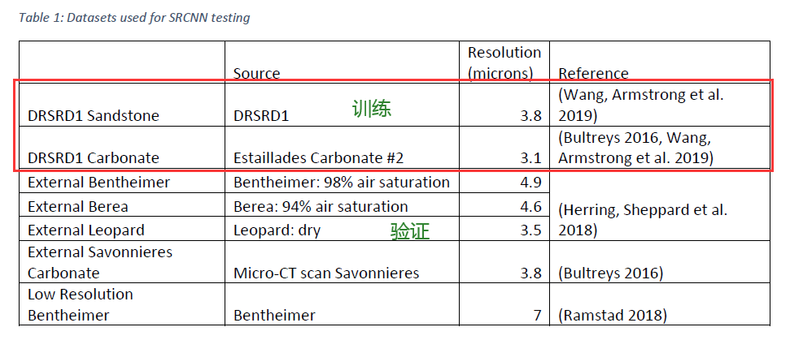

- SR-Resnet

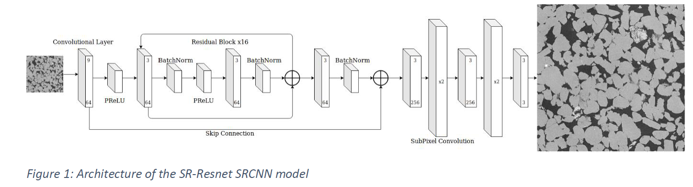

- EDSR（Enhanced Deep SR）

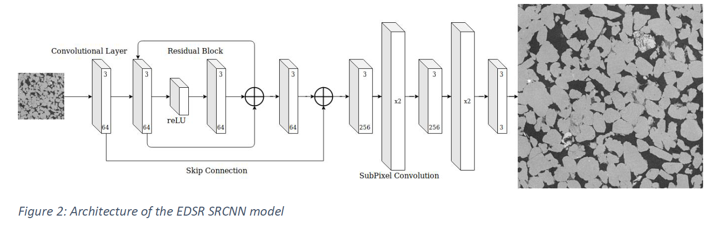

- WDSR（Enhanced Deep SR）

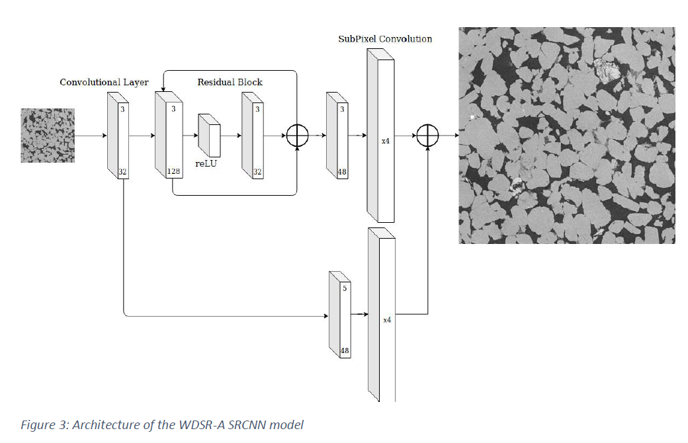

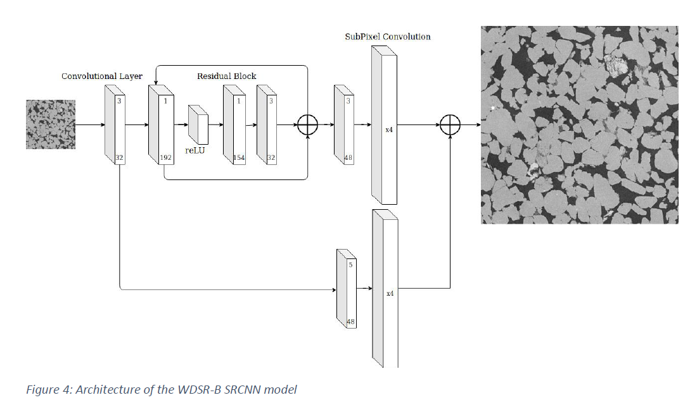

次像素卷积将LR映射到HR图像的效率更高

WDSR效果更好参数少，2D超分

LR图像添加高斯白噪音和高斯模糊训练出来的网络能够保留边缘锐度并抑制颗粒内的噪点，便于后续的图像分割工作

如果无法区分噪点是自然噪点还是微孔隙，会将它们都去除

## Application of Super-Resolution Convolutional Neural Network for Enhancing Image Resolution in Chest CT

传统浅层SRCNN，较线性插值效果不错

peak signal-to-noise ratio (PSNR) 、 structural similarity (SSIM)、差值图像（HR-SR）评估，单因素方差分析和Tukey的检验

## Enhancing Resolution of Digital Rock Images with Super Resolution Convolutional Neural Networks

一模一样Super Resolution Convolutional Neural Network Models for Enhancing Resolution of Rock Micro-CT Images

## CT-image of rock samples super resolution using 3D convolutional neural network

提出了3DSRCNN

图片按不同倍率下采样然后双三次插值回原尺寸用作训练，得到的模型能够实现不同倍率超分辨的功能（单模型多尺度超分辨），得到的模型效果甚至会略好于针对不同的放大倍率分别地训练模型

优选了模型深度和kernel size，使用了残差网络/学习（能够有效解决训练过程不稳定的问题），使用了SGD优化器（参数：动量，动量系数，学习速率[随epoch逐渐减小]，gradient clipping梯度裁剪使梯度控制在一个范围内），使用了PNSR、SSIM进行评估

为了解决内存和数据量小的问题，将原始图像有重叠地裁切后用作训练数据，且会富有冗余信息，有利于捕捉到LR→HR的映射关系

3D超分存在的问题：2DSR网络不能直接使用，需要重新设计；3D训练样本不易获取，获取的图像可能因为对比度低或孔隙结构复杂不能用于训练；计算量和时间的问题，要应用在通用计算设备上。

网络深度越深，提取的特征更具有全局性，感受野也会逐渐变大，能捕捉更丰富的纹理细节；但是训练会越不稳定且数据量小时会过拟合效果反而不好

MSE做损失函数可能会使图像过度光滑，但是它有利于优化模型获得更高的PNSR值

比较了不同方法的效果（双三次、2D-VDSR、3D稀疏表示、3DA+）

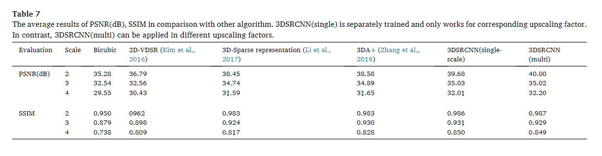

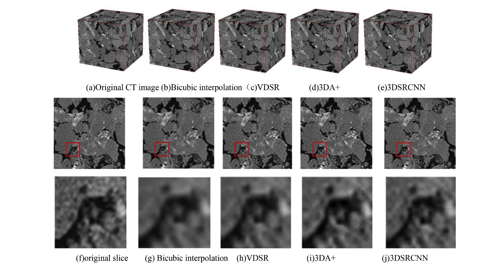

## Digital Rock Core Images Resolution Enhancement with Improved Super Resolution Convolutional Neural Networks

使用混合插值（双线性、双三次插值）方法加快计算

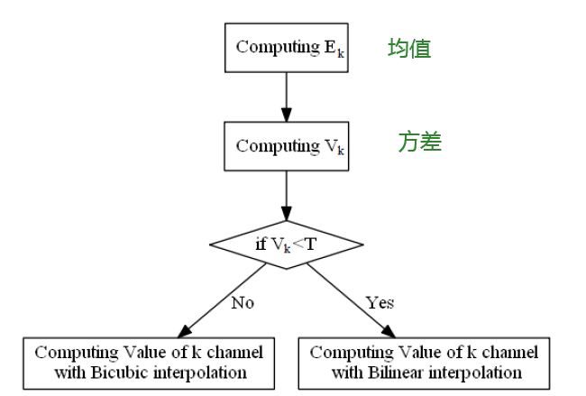

## Deep learning in pore scale imaging and modeling

数字岩心的应用范围

目前问题：成像中， FOV和分辨率的权衡；建模中，3D模拟的可扩展性跟不上成像能力的提升，受内存和计算速度限制不能计算大网格模型。

深度学习在孔隙尺度成像与建模中的应用：

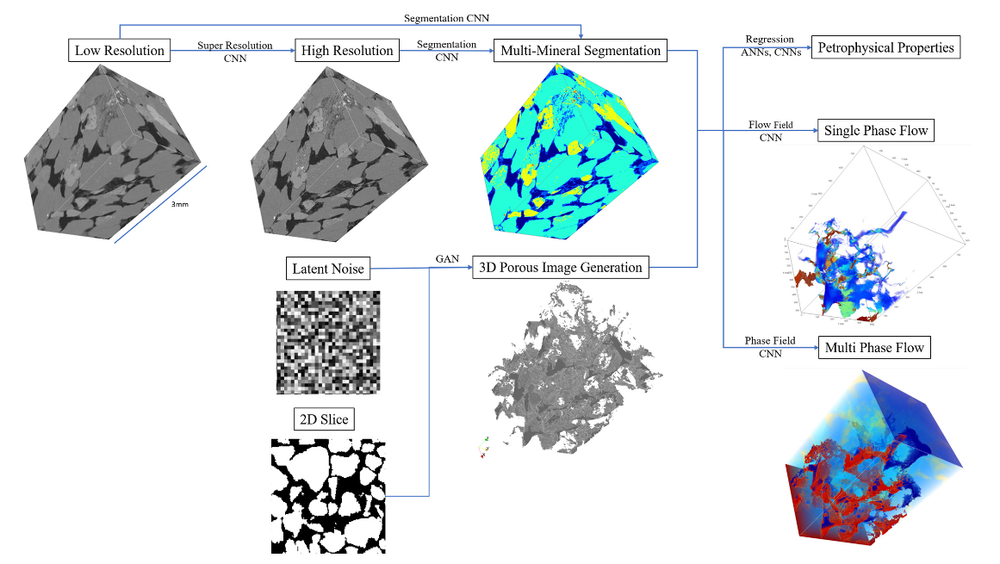

- 图像分割 常规方法：简单阈值分割、多步标记法、分水岭算法

通常基于SEM图像，因其图像精度高、噪点少、易与EDS结合

二元分割：对于高噪声图片，CNN精度比人工分割高，错误主要会集中在微孔隙区域

多矿物分割：3D U-ResNet效果很好

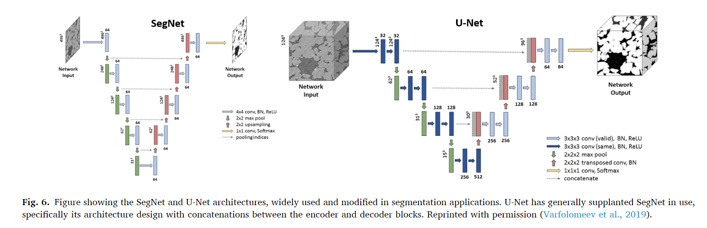

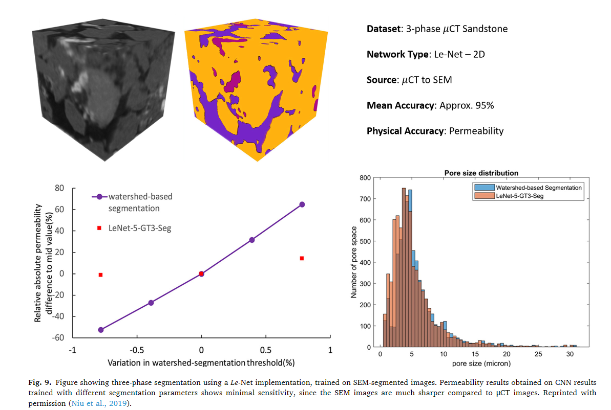

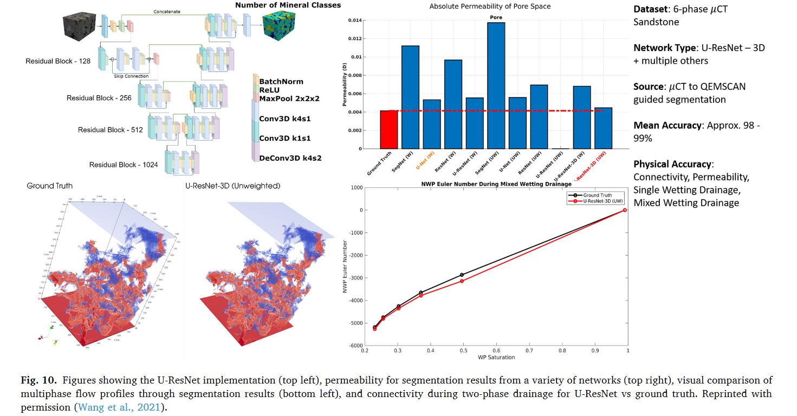

微米CT图像难以分割，一般先使用微米CT-SEM图像来训练（input μCT图像，label 基于SEM分割的图像），通过学习映射关系解决μCT图像难分割的问题，但是很难获取高精度可靠的数据集，这就限制了训练数据集的大小；图像精度、拓扑精度和油层物理精度应该一起来衡量效果好坏；3D图像能够提供更丰富的信息以更好地分割，但是计算量很大；CNN网络的灵活性有很大限制，可以考虑使用CycleGAN风格迁移解决。

总的来说主要是缺少可靠、丰富、高精度的数据用来训练，缺少较好的评估标准。

 

- 图像质量增强

图像插值/超分辨率

batch normalization会降低SRCNN的精度，目前几乎不再使用；L1 loss比L2 loss 更具有鲁棒性，而且会加快收敛速度

SRCNN会将细小纹理当做噪声处理，解决此问题需要使用混合损失函数（L1/L2像素损失+特征损失[预训练模型卷积层中提取的纹理的L2损失]）。SRGAN能提升分辨率并恢复纹理，但是像素精度不高(人眼感知精度高)且会将噪点和纹理一起恢复。

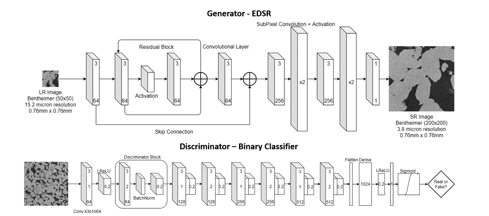

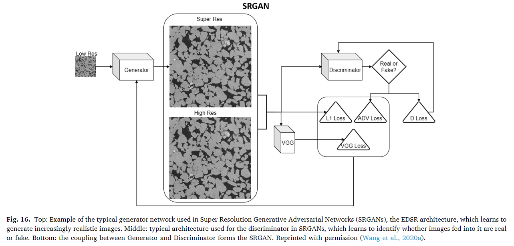

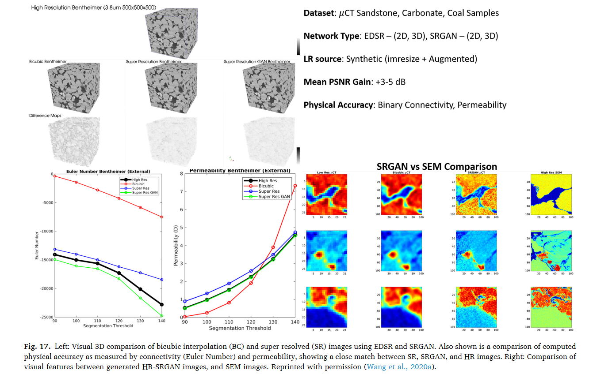

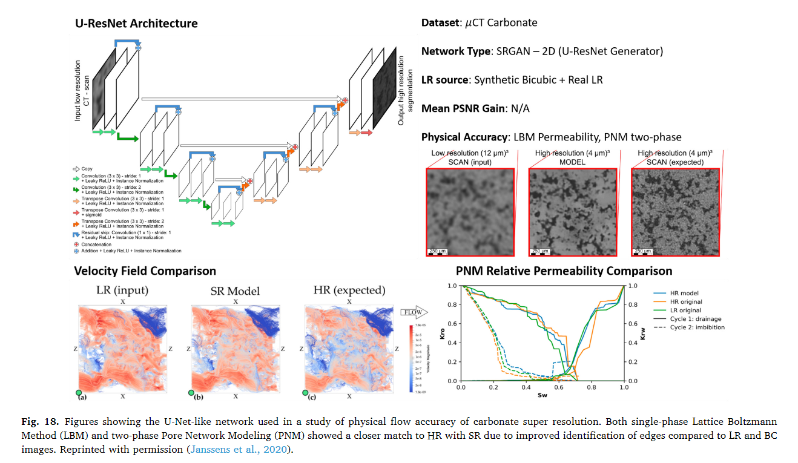

物理精度评估方法：渗透率、连通性（欧拉数）、孔隙网络模型（PNMs）两相流模拟、LBM单相流模拟

SRCNN和SRGAN训练集需要逐像素匹配的LR和HR图像用作训练，SRCycleGAN能够学习不配对的LR到HR的映射关系。

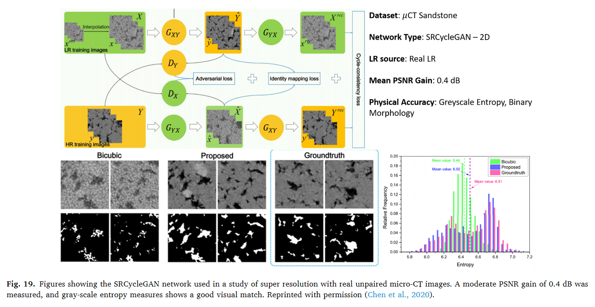

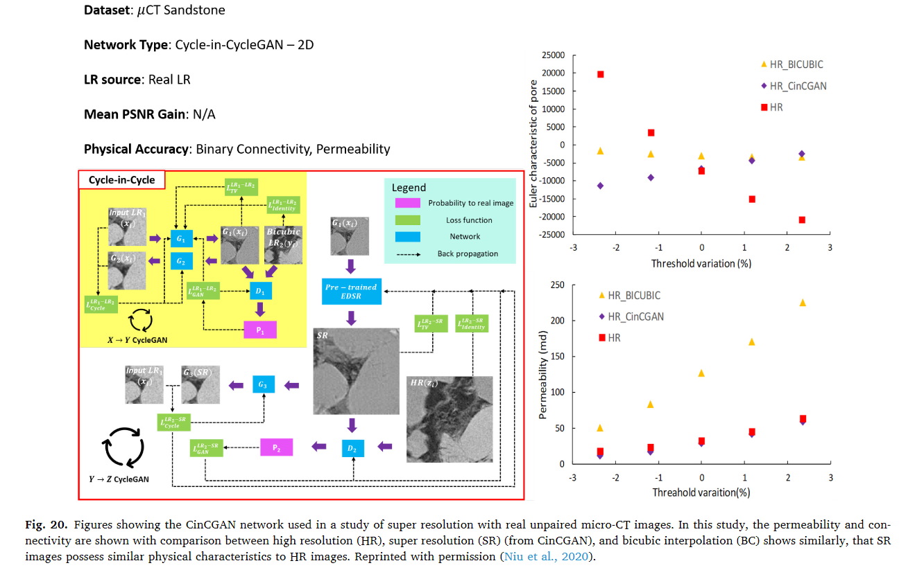

Cycle-in-CycleGAN(CinCGAN)分别使用不同的循环来进行降噪、去模糊和超分，而SRCycleGAN用一个generator去同时完成三个任务。

GAN网络性能受限，对损失函数敏感，最小化损失比较困难（难训练）；为了解决此问题可以混合使用，cycleGAN+SRGAN/SRCNN或着分别使用：cycleGAN去噪点去模糊，SRGAN超分辨

 

- 图像生成/扩展

图像重构的含义：2D图像生成3D图像；生成具有相同统计特征的的图像

重构常用MPS、SA，这些基于学习的方式可以看作是最小化问题，能够很好地使用ML方法处理，最常用的是GAN。

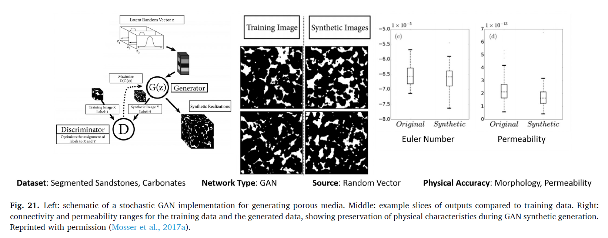

随机数向量通过CNN转置卷积层来实现upsampling和decoding

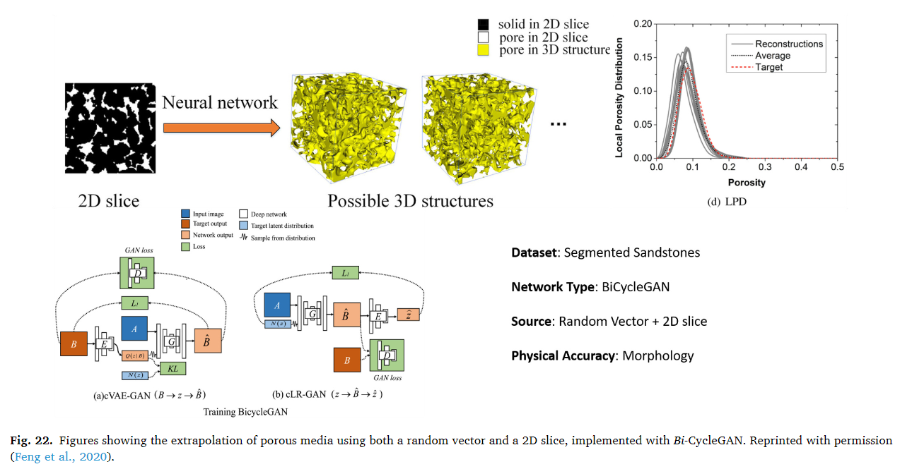

噪声+2D图片 使用BiCycleGAN生成三维图像

 

- 孔隙尺度建模

按精度由低到高（速度由快到慢），单相流模拟方法有：孔隙网络模型（PNMs）、半解析拉普拉斯解（ Semi-Analytical Laplace Solvers，SASs）、直接模拟方法（LBM、有限体积法解纳维斯托克斯方程Finite Volume Methods to solve the Navier Stokes Equation ，NSE）；前两种渗透率评估效果好，后两种可以计算速度场。

多相流中，常用PNMs和LBM，LBM耗费计算资源。

两大流派：利用几何数据回归油层物理性质参数，进行尺度升级，如渗透率；流动模拟求解器，预测流动场，最后再经过处理求解渗透率等参数

**油层物理性质回归：使用图像特征回归，直接使用图片回归**。

（1）图像特征回归

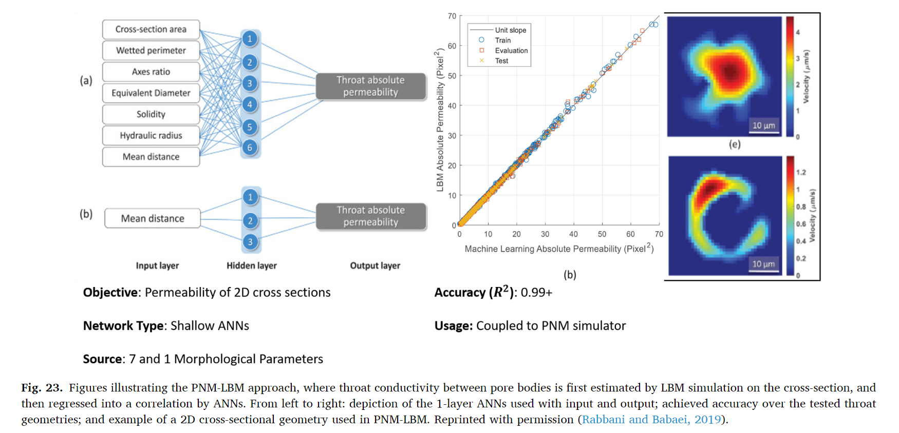

使用7个/1个参数拟合预测渗透率，效果很好，主要是因为小的2D截面相对简单。

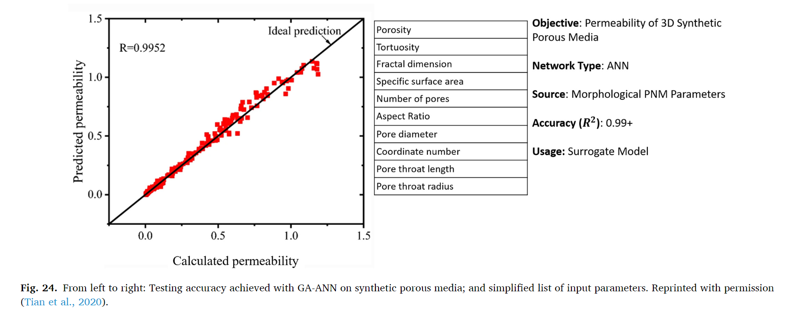

3D岩心预测，效果好主要因为样本分布相对统一，渗透率分布窄。

（2）图片直接回归

模型性能主要取决于网络结构和数据集，不依赖输入参数的选取。

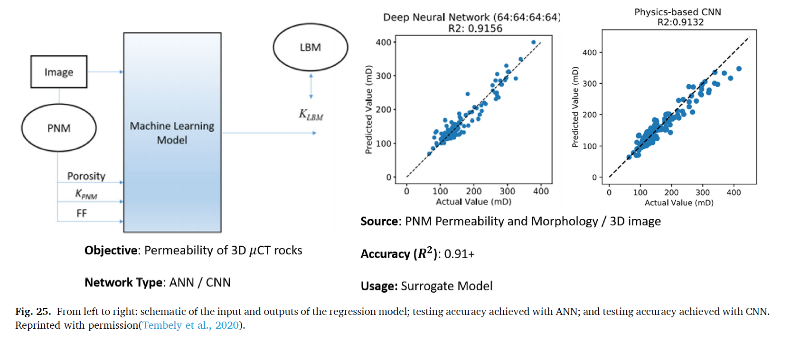

分别使用了3D图像特征和图像进行了预测，并比较了传统模型于CNN的应用效果。

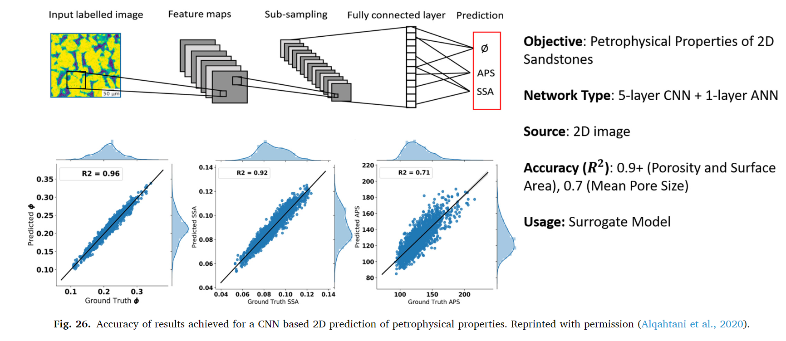

2D分割和灰度图像作为输入，预测精度：2值图像的孔隙度、比表面积>灰度图像的孔隙度、比表面积>两者的平均孔隙大小预测

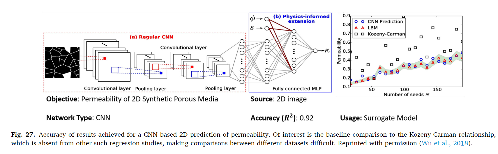

预测几何网格图像渗透率，在训练图像上效果较好，但测试集精度不高。

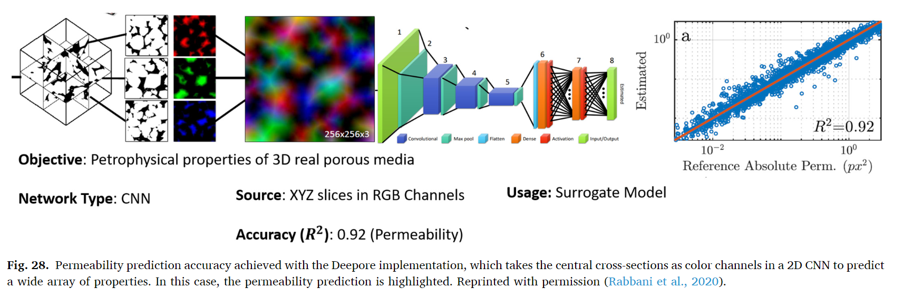

伪3D图像预测，将沿三个轴的截面分别放入三个通道channel，使用2DCNN进行训练

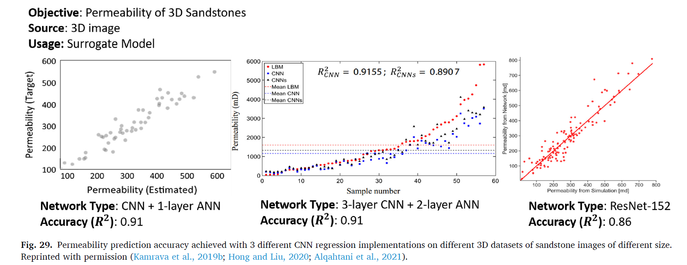

3DCNN预测渗透率

存在问题：没有统一的比较标准和测试集，目前研究的都是单相流问题（预测单相流渗透率）。

**孔隙尺度流动模拟**

直接预测油层物理性质结果不确定性很大，而预测速度场的难度很大。一个可行的方法是将ML（快，精度低）与直接流动模拟（慢，精度高）结合。

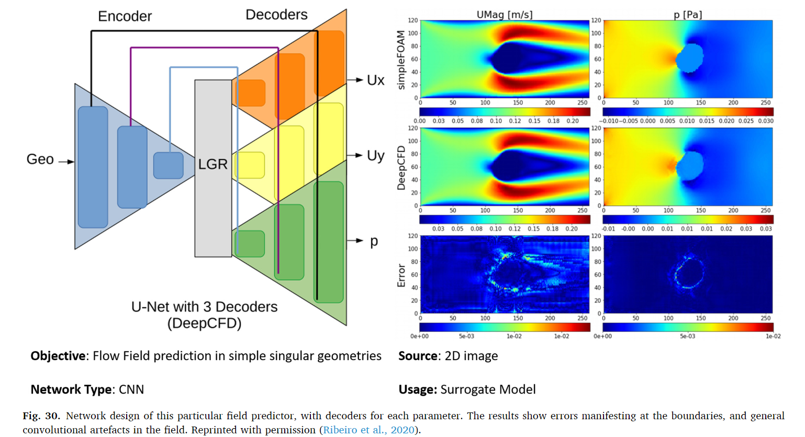

使用U-Net预测2D速度场，分别用3个decoder：x，y速度、压力。若在数据或网络方面不施加干预或改进，直接使用CNN预测复杂孔隙结构的流场精度很低。以下三种网络全部使用LBM来训练CNN。

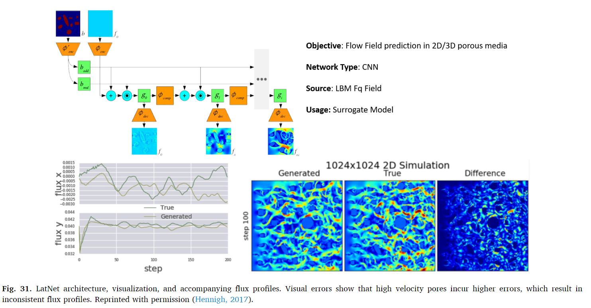

LatNet：以LBM Fq场作为输入2D3D速度场预测，且不单单适用于稳态流。涡流强度高、流速快的地方预测不好，流场中小尺度特征难捕捉

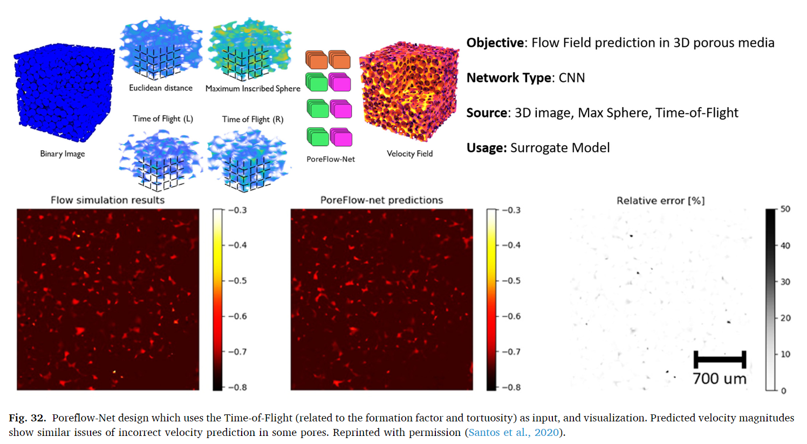

Poreflow-Net：稳态流速度场预测，预处理计算Time-of-Flight (TOF)作为输入，耗费计算资源。逐块计算。速度场预测精度高，渗透率预测效果和CNN类似但是能够提供一个可视化的视图。

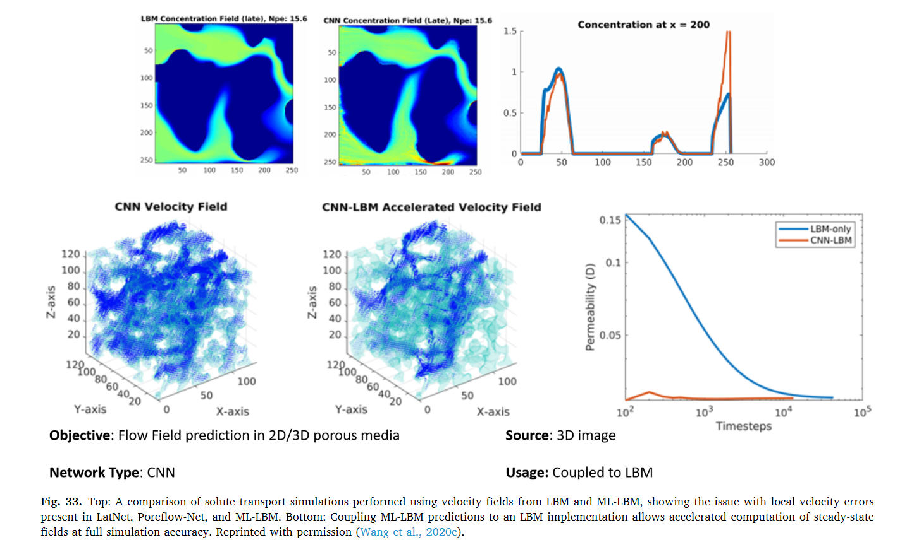

ML-LBM：渗透率预测效果好。但是像LatNet预测截面流出现的问题、LatNet和Poreflow-Net预测速度的大小/位置出现的问题在ML-LBM中仍会出现，孔隙结构越复杂这种问题越明显。说明CNN不适合直接预测速度场，但是可以考虑将ML方法（如CNN）与直接模拟方法（如LBM）结合，能够大大加速计算。

误差主要出现在边界附近和狭小的喉道。

对于复杂的孔隙结构，即使能保证由速度场计算得出的渗透率精度很高，也不能保证该速度场的逐体像素的精度能够达到很高。

### 面对的挑战

- 数据集的可用性和基准（benchmark）
- 标准化的精度评估方法
- 泛化能力
- DL的精度
- DL的可扩展性